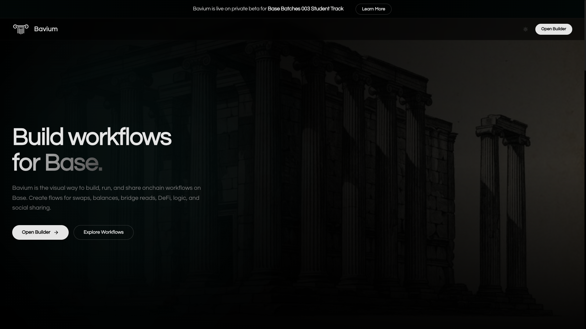
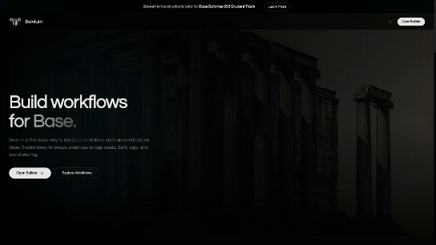
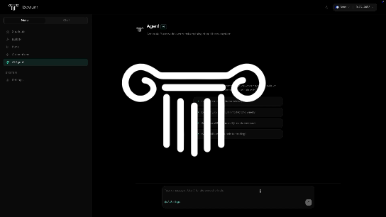
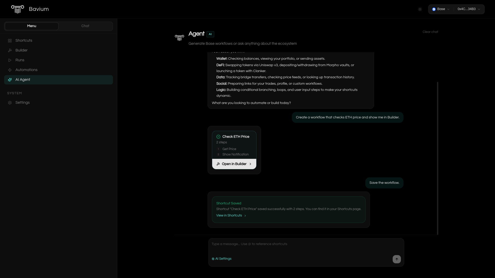
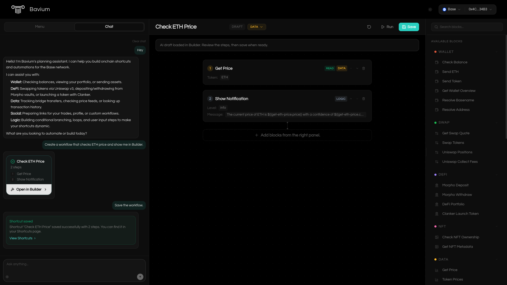
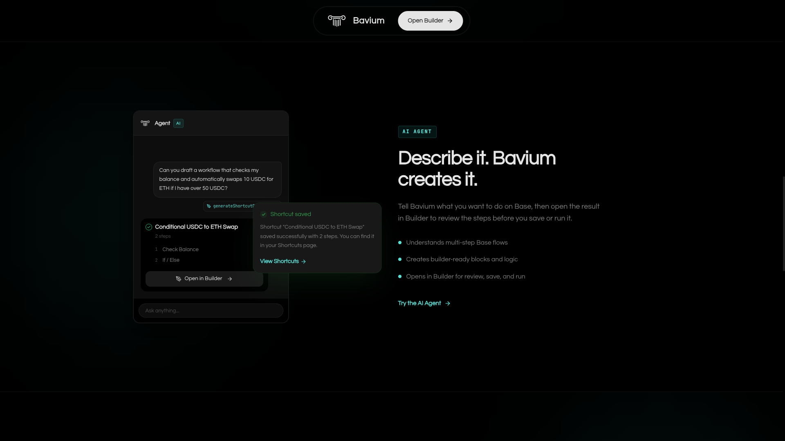
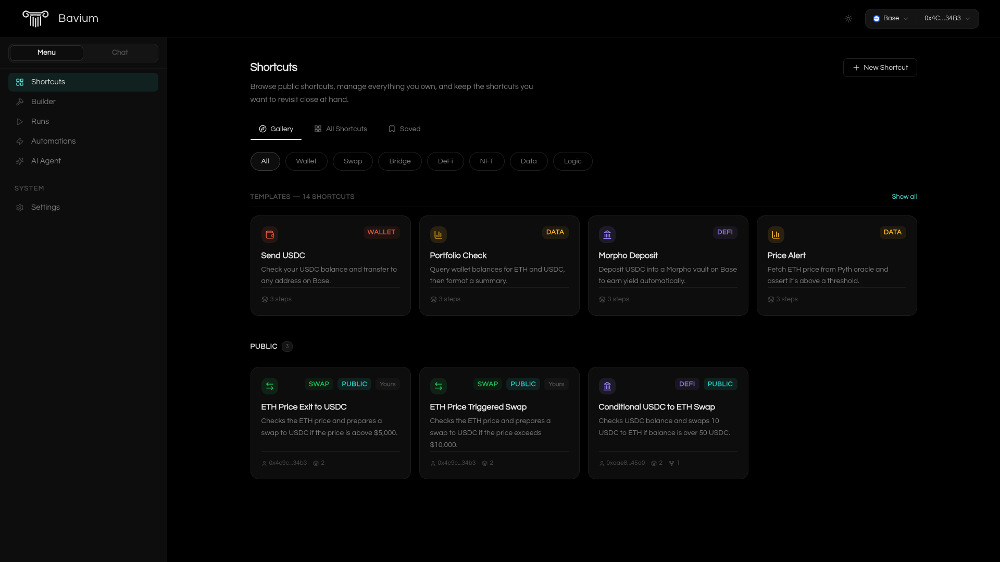
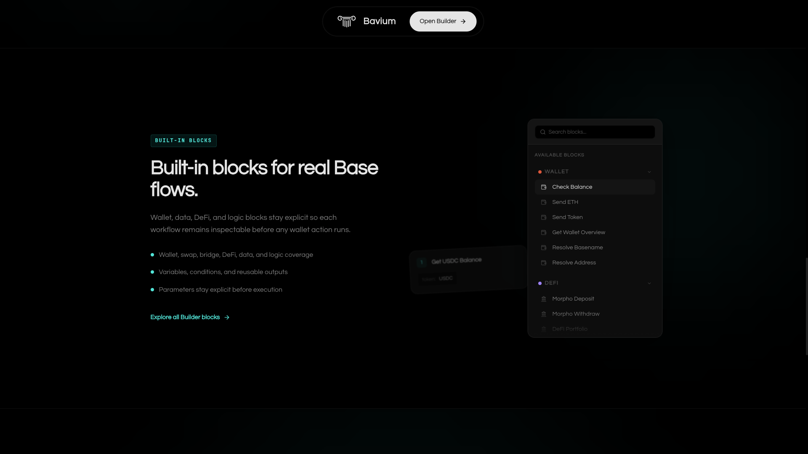

<div align="center">
  

  # Bavium

  **The workflow builder for Base.**

<p align="center">
    
</p>

  <sub>Built for the Base Batches 003 Student Track</sub>

  [Demo](#overview) · [AI Agent](#ai-agent) · [Skills](#skill-catalog) · [Architecture](#architecture) · [Quickstart](#quickstart)

</div>

---

## Overview

<p align="center">
    
</p>

Bavium turns complex onchain workflows into drag-and-drop workflows.

Visual way to build, run, and share onchain workflows on Base. It lets users create reusable flows for swaps, balances, bridge reads, data reads, DeFi, social sharing, and onchain actions, then inspect what runs before execution.

The product is intentionally **user-controlled**, **visual**, and **inspectable**:

- Users stay in control of their wallet, API keys, and approvals.
- AI-assisted workflow drafting is **BYOK** (bring your own OpenAI / Anthropic / Google key) — no server-side LLM relay.

Bavium is **not** an agent that spends your money; it's a **workflow surface** for Base.

---

## AI Agent

<p align="center">
    
</p>

Bavium includes a project-aware AI planning assistant. It understands the same skill registry that powers the visual Builder, so it can turn natural language into real workflow drafts instead of generic chat suggestions.

<p align="center">
    
</p>

Describe your intent — *"Create a workflow that checks my ETH balance, swaps to USDC if it is above 0.5 ETH, and notifies me"* — and the agent drafts a structured shortcut using real Bavium blocks: wallet reads, swaps, data feeds, logic branches, notifications, Base App links, and more.

The important part is the handoff from chat to a reviewable workflow:

1. **Draft from natural language.** The agent calls `generateShortcutDraft` and returns a preview card, not raw JSON.
2. **Open in Builder.** The draft is hydrated into the visual canvas so you can inspect each block, edit parameters, and remove anything you do not want.
3. **Save or reuse.** When signed in, the agent can save a shortcut directly only when you explicitly ask it to. Otherwise you save from Builder after review.
4. **Stay within product limits.** The agent knows Bavium's current boundaries: swaps are Uniswap v3 single-pool flows, bridge is read-only planning/tracking, automations reject signature-required blocks, Base sharing prepares links/copy, and x402 is discovery-only.

<p align="center">
    
</p>

**What the AI can do**

- Explain what Bavium's blocks do and which ones fit a workflow.
- Draft new shortcuts from a prompt.
- Modify an existing Builder draft when the Builder context is available.
- Search saved shortcuts and load shortcut details after wallet sign-in.
- Open a generated draft in Builder for review.
- Save a shortcut only when explicitly requested and authenticated.

<p align="center">
    
</p>

**Privacy and control**

- **BYOK:** OpenAI, Anthropic, or Google keys stay in the browser. Bavium forwards only the model call you authorize.
- **Wallet-scoped memory:** chat history is stored per wallet address in `localStorage`.
- **Human approval:** the AI drafts; the user reviews, saves, runs, and signs.

---

## Why Bavium

<p align="center">
    
</p>

| Principle | What it means in practice |
|---|---|
| **Truthfulness over theatrics** | Every block declares exactly what it will read or sign. The AI planner cannot invent skills that don't exist (skills are enforced through a typed manifest). |
| **Inspectable before signature** | A multi-step flow (wrap, approve, swap) shows you its simulation output, gas preview, and encoded calls before you hit sign. |
| **BYOK AI** | Your API keys stay in your browser. Server only forwards the exact model call you authorized. |
| **Local-first UX** | Drafts, chats, and preferences are persisted wallet-scoped in `localStorage`. Nothing in the cloud until you explicitly save or publish. |
| **Attribution by default** | ERC-8021 `dataSuffix` is appended to every write transaction when a Builder Code is configured, so Base can credit the workflow origin. |
| **Safe automations** | Scheduled automations are preflight-validated to reject any step that would need a human signature or confirmation, so a cron job can never silently hang on an approval popup. |

---

## Base Batches 003: Student Track Focus

Bavium is prepared for the **Base Batches 003 Student Track** private beta. The submission showcases four demo paths:

1. **Build** — drag blocks to compose a Base workflow (swap, send, portfolio, Morpho deposit).
2. **Chat** — ask the AI agent to draft a shortcut in natural language; review and hand-off to the Builder.
3. **Run** — execute the shortcut with a wallet-connected pre-flight review.
4. **Share and Automate** — publish the shortcut to a public URL, prepare Base-ready share copy or openable links, or schedule it as a read-only automation.

---

## What Works Today

### Core surface
- Visual Builder with 45 typed onchain/offchain blocks.
- Wallet-aware skills for wallet, swap, bridge reads, DeFi reads/actions, NFT reads, data, and logic.
- Shortcut gallery with **14 skill-backed templates**, one-click canvas hydration.
- AI chat (Sidebar Chat + full-page `/chat`) with persistent history per address.
- Saved shortcuts, published shortcut pages with shareable URLs.
- Runs tab with full execution artifacts (inputs, step-by-step outputs, tx hashes), restore-to-Builder, and delete flows.

### Onchain capability
- **Wallet**: native ETH / ERC-20 balance, send ETH, send ERC-20, wallet overview, and Basename forward + reverse resolution via the Base L2 Resolver.
- **Swap**: Uniswap v3 quotes, prepared swaps (wrap, approve, exactInputSingle, unwrap), positions view, fee collection.
- **DeFi**: Morpho vault deposit / withdraw / positions, Clanker token deployment preparation (Sepolia first).
- **Bridge**: Across route listing, cost quote preview (mainnet and testnet separated, read-only).
- **NFT**: ERC-721 / ERC-1155 ownership check and token metadata reads.
- **Data**: Pyth spot prices, CoinGecko batch prices, token registry, wallet activity history.

### Offchain capability
- **Social**: prepared Base-ready share copy, published workflow shares, Base profile links, Base token links, and transaction explorer links.
- **Logic**: variable math, string formatting, assertions, conditional branches (if/else), ask-input, menu choice, notify.
- **x402 (read-only)**: Bazaar service discovery for HTTP endpoints and MCP tools. No automatic payments or paid resource fetches.

### Security and infrastructure
- SIWE / RainbowKit authentication with persistent session cookies (`httpOnly`, `secure`, `sameSite: lax`).
- Server-scoped rate limiting on nonce endpoints (in-memory + Convex durable store).
- Same-origin checks + no-store headers on sensitive API routes.
- Coinbase Smart Wallet is the primary recommended wallet path.

---

## Skill Catalog

<p align="center">
    
</p>

Bavium's blocks live under `src/skills/*`. Each skill is a typed manifest entry with explicit inputs, outputs, network support, and confirmation requirements.

| Category | Skills |
|---|---|
| **wallet** | `get_balance`, `details`, `send_eth`, `send_token`, `resolve_basename`, `resolve_address` |
| **swap** | `uniswap_quote`, `uniswap_prepare_swap`, `uniswap_positions`, `uniswap_collect_fees` |
| **defi** | `morpho_deposit`, `morpho_withdraw`, `morpho_portfolio`, `clanker_deploy_token` |
| **bridge** | `list_routes`, `get_quote`, `track_transfer` |
| **nft** | `check_ownership`, `get_token_metadata` |
| **data** | `pyth_price`, `token_prices`, `portfolio_snapshot`, `wallet_activity` |
| **tx** | `get_receipt`, `wait_confirmation` |
| **social** | `prepare_base_share`, `prepare_trade_share`, `prepare_shortcut_share`, `prepare_open_profile`, `prepare_open_token`, `prepare_open_tx` |
| **x402** | `discover_services` |
| **logic** | `if_else`, `repeat`, `repeat_each`, `set_variable`, `get_variable`, `math`, `format`, `assert`, `ask_input`, `choose_menu`, `notify`, `wait`, `stop` |

---

## Architecture

```
┌───────────────────────────────────────────────────────────────┐
│                         Next.js App Router                    │
├───────────────────────────────────────────────────────────────┤
│  Builder page  │  Shortcuts  │  Runs  │  Chat  │  Settings    │
├─────────────┬─────────────┬──────────────┬────────────────────┤
│  Engine     │  Skills      │  Auth (SIWE) │  AI (BYOK SDK)    │
│  executor   │  wallet,     │  nonce +     │  OpenAI / Google /│
│  validation │  swap, defi, │  session     │  Anthropic        │
│  automation │  bridge, nft │  cookies     │  tool-gated plan  │
│  runner     │  data, social│              │                   │
│             │  x402, logic │              │                   │
├─────────────┴─────────────┴──────────────┴────────────────────┤
│ viem public client (fallback + multicall) · wagmi · RainbowKit│
├───────────────────────────────────────────────────────────────┤
│                    Base mainnet / Base Sepolia                │
└───────────────────────────────────────────────────────────────┘
        │
        ▼
┌───────────────────────────────────────────────────────────────┐
│                    Convex Cloud Backend                       │
│  shortcuts, runs, nonces, rate-limits, automations, logs      │
└───────────────────────────────────────────────────────────────┘
```

**Key design invariants:**

1. **Skill manifest is the source of truth.** Builder UI, validator, executor, and AI planner all consume the same typed registry (`src/lib/skill-manifest.ts`). No handwritten skill lookups in UI.
2. **Prepared transactions, not direct sends.** Skills return `PreparedTransactionOutput` objects; the UI layer submits those calls with wagmi and appends ERC-8021 attribution when configured.
3. **Automation preflight.** `validateShortcutForAutomation` rejects any step that would need a user signature or confirmation — so scheduled runs can never silently block.
4. **Read before write.** Every write skill first simulates (`simulateContract`) or estimates (`estimateGas`) before returning to the UI.
5. **Wallet-scoped persistence.** Chat messages, draft shortcuts, and settings are namespaced by `address + chainId`, so switching wallets never leaks state.

---

## Tech Stack

- **Runtime** — Next.js 16 App Router, React 19, TypeScript strict.
- **Onchain** — viem, wagmi, RainbowKit.
- **Backend** — Convex (development cloud and production).
- **AI** — Vercel AI SDK with OpenAI, Google, and Anthropic support (BYOK).
- **UI** — Tailwind CSS 4, Framer Motion, Lucide icons, React Markdown + `remark-gfm`.
- **State** — Zustand, React Query.

---

## Quickstart

### 1. Clone and install

```bash
git clone https://github.com/system-base/bavium.git
cd bavium
npm install
```

### 2. Copy env template

```bash
cp .env.example .env.local
```

### 3. Fill in secrets

Generate random secrets for each `replace-with-a-random-secret` placeholder:

```bash
openssl rand -hex 32
```

Get a free WalletConnect project ID from [Reown Dashboard](https://dashboard.reown.com) and paste it into `NEXT_PUBLIC_WC_PROJECT_ID`. Without a real ID you will hit demo rate limits after a few minutes.

### 4. Start Convex dev cloud

```bash
npm run convex:dev
```

This command prints `CONVEX_DEPLOYMENT` and `NEXT_PUBLIC_CONVEX_URL` values — copy them into `.env.local`.

### 5. Run the app

In a second terminal:

```bash
npm run dev
```

Open [http://localhost:3000](http://localhost:3000), connect a Base Sepolia wallet, and explore the Shortcuts tab.

---

## Environment Variables

| Variable | Scope | Required | Purpose |
|---|---|---|---|
| `NEXT_PUBLIC_NETWORK_ID` | public | yes | Default network (`base` or `base-sepolia`). |
| `NEXT_PUBLIC_WC_PROJECT_ID` | public | **yes in production** | Real Reown project ID. Avoid `YOUR_PROJECT_ID` demo fallback in production. |
| `NEXT_PUBLIC_BASE_MAINNET_RPC_URL` | public | no | Client-safe override for Base mainnet reads. Fallback is the official Base public RPC. |
| `NEXT_PUBLIC_BASE_SEPOLIA_RPC_URL` | public | no | Client-safe override for Base Sepolia reads. |
| `NEXT_PUBLIC_APP_URL` | public | yes | Used by the frontend for absolute share URLs. |
| `NEXT_PUBLIC_BASE_BUILDER_CODE` | public | no (encouraged) | ERC-8021 Builder Code appended to write transactions. Register on [base.dev](https://base.dev) first. |
| `NEXT_PUBLIC_CONVEX_URL` | public | yes | Convex deployment URL (set by `convex dev`). |
| `APP_URL` | server | yes | Used by Convex scheduler to call the secure automation endpoint. Must match your public URL in production. |
| `CONVEX_DEPLOYMENT` | server | yes | Convex deployment identifier (dev cloud or prod). |
| `CONVEX_SERVER_SECRET` | server | yes | Shared secret between Next.js API routes and Convex internal functions. |
| `AUTH_SESSION_SECRET` | server | yes | HMAC secret for session cookies. `openssl rand -hex 32`. |
| `CRON_SECRET` | server | yes | Secret used by Convex cron to call Next.js `/api/automations/check`. `openssl rand -hex 32`. |

**Important:**
- Never commit `.env.local`.
- Never place authenticated RPC keys into `NEXT_PUBLIC_*` variables — they end up in the browser bundle.
- Production values should differ from development secrets.
- `NEXT_PUBLIC_APP_URL` and `APP_URL` must stay aligned; otherwise cron callbacks POST to localhost and silently fail.

---

## Project Structure

```
bavium/
├── convex/                   # Convex functions, schema, crons
│   ├── schema.ts             # shortcuts, runs, nonces, rateLimits, automations, logs
│   ├── shortcuts.ts          # publish / save / delete
│   ├── runs.ts               # execution artifacts
│   ├── automations.ts        # scheduled/polling automations
│   └── cron.ts               # Convex cron schedule
│
├── src/
│   ├── app/                  # Next.js App Router
│   │   ├── (app)/            # Authenticated app shell
│   │   │   ├── builder/      # Main Builder canvas
│   │   │   ├── shortcuts/    # Templates + saved gallery
│   │   │   ├── runs/         # Execution artifacts
│   │   │   ├── chat/         # Full-page AI chat
│   │   │   └── settings/     # BYOK + preferences
│   │   ├── api/              # Auth, automation check, AI proxy endpoints
│   │   ├── providers.tsx     # Wagmi + RainbowKit + SIWE bridge
│   │   └── layout.tsx
│   │
│   ├── engine/               # Shortcut executor, validator, automation runner
│   ├── skills/               # Typed skill implementations
│   │   ├── wallet/
│   │   ├── swap/
│   │   ├── defi/
│   │   ├── bridge/
│   │   ├── nft/
│   │   ├── data/
│   │   ├── social/
│   │   ├── tx/
│   │   ├── x402/
│   │   └── logic/
│   ├── lib/                  # Shared: viem-client, auth, basename, templates, manifest
│   ├── hooks/                # useAuthSession, useBuilderDraft, useRunPlayback...
│   ├── contexts/             # AIChatContext, WalletContext
│   └── components/           # Layout, Builder UI, chat, toasts...
│
├── public/                   # Logo, favicons, og images, demo assets
├── .env.example              # Annotated env template
└── package.json
```

---

## Scripts

```bash
npm run dev            # Next.js dev server
npm run build          # Production build
npm run lint           # ESLint
npm run typecheck      # Clean build + tsc --noEmit

npm run convex:dev     # Convex dev cloud sync (keep running in a second terminal)
npm run convex:push    # One-shot push of current schema + functions
npm run convex:deploy  # Push to production Convex (only for public release)
```

## Acknowledgments

- [Base](https://base.org) — Coinbase L2, builder program, and base.dev tooling.
- [RainbowKit](https://www.rainbowkit.com), [wagmi](https://wagmi.sh), [viem](https://viem.sh) — the stack that makes wallet UX sane.
- [Convex](https://convex.dev) — real-time backend.
- [Uniswap](https://uniswap.org), [Morpho](https://morpho.org), [Across](https://across.to), [Clanker](https://clanker.world), [Pyth](https://pyth.network) — the DeFi primitives.
- [Vercel AI SDK](https://sdk.vercel.ai) — unified BYOK provider surface.

---

<div align="center">
<sub>Built for Base</sub>
</div>
